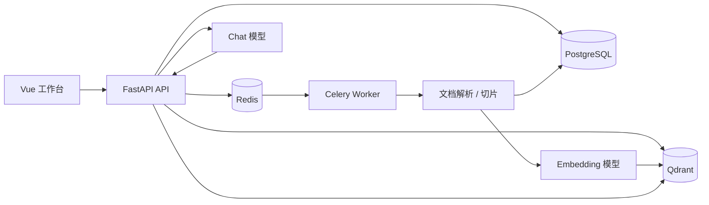
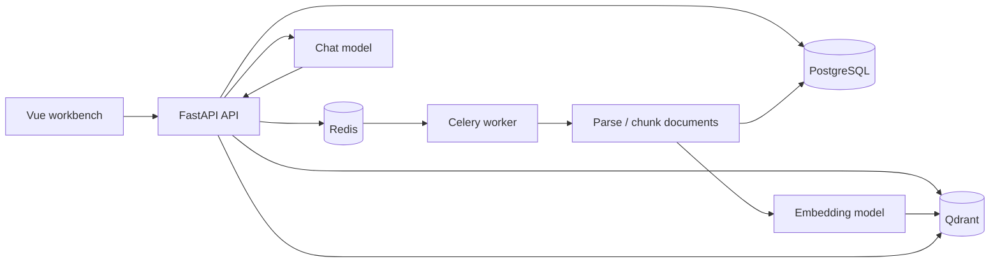

# knowmate 知友

> A WeKnora-style knowledge-base RAG project rebuilt with Python, FastAPI, Vue, PostgreSQL, Redis, Celery, and Qdrant.

knowmate 知友是一个参考并复刻 [Tencent/WeKnora](https://github.com/Tencent/WeKnora) 产品思路的知识库问答项目。它保留了“知识库创建、文档上传、文档解析、切片入库、向量检索、快速问答”的核心链路，但后端改为 Python / FastAPI 实现，不再使用 WeKnora 原项目中的 Go 后端。

This repository is a WeKnora-inspired knowledge-base RAG implementation. It follows the core workflow of creating knowledge bases, uploading documents, parsing and chunking content, writing vectors, retrieving relevant chunks, and generating quick answers. The major difference from Tencent/WeKnora is that the backend is rebuilt with Python and FastAPI instead of Go.

## 目录 / Contents

- [中文说明](#中文说明)
- [English README](#english-readme)

## 中文说明

### 项目定位

knowmate 知友面向私有知识库问答场景，适合用来验证或二次开发 WeKnora 风格的 RAG 链路。当前版本更偏工程骨架和端到端验证台，包含后端 API、异步文档处理、向量检索、模型配置和一个 Vue 快速问答工作台。

### 与 WeKnora 的关系

- 参考对象：[Tencent/WeKnora](https://github.com/Tencent/WeKnora)
- 相同方向：知识库管理、文档摄取、RAG 检索增强问答、OpenAI 兼容模型接入
- 主要差异：本项目后端使用 Python / FastAPI 重构，存储和异步任务链路围绕 SQLAlchemy、Alembic、Celery、Redis、Qdrant 组织
- 说明：本项目不是 Tencent/WeKnora 官方项目，也不代表原项目团队立场

### 功能特性

- 知识库创建与查询
- 支持上传 `.txt`、`.md`、`.pdf`、`.docx` 文档
- 文档解析、文本切片、前后切片关系记录
- 基于 Celery 的异步文档处理
- 基于 Qdrant 的向量写入和相似度检索
- OpenAI 兼容模型配置、连通性测试和 API Key 加密存储
- 支持 Qwen / DashScope 兼容模式预设
- 快速问答接口返回答案和来源片段
- FastAPI 托管 Vue 构建产物，提供一页式测试工作台
- pytest 测试覆盖核心解析、切片、模型配置和 API 流程

### 技术栈

| 模块 | 技术 |
| --- | --- |
| 后端 | Python 3.11+, FastAPI, Pydantic, SQLAlchemy |
| 数据库 | PostgreSQL, Alembic |
| 异步任务 | Celery, Redis |
| 向量库 | Qdrant |
| 模型接入 | OpenAI Python SDK, OpenAI-compatible API |
| 前端 | Vue 3, Vite, lucide-vue-next |
| 测试与质量 | pytest, Ruff |

### 架构概览



### 快速开始

#### 1. 准备环境

请先安装：

- Python 3.11+
- Node.js 20+（用于构建前端）
- Docker / Docker Compose（用于 PostgreSQL、Redis、Qdrant）

#### 2. 安装 Python 依赖

```powershell
python -m venv .venv
.\.venv\Scripts\Activate.ps1
python -m pip install -e ".[dev]"
```

#### 3. 准备环境变量

```powershell
Copy-Item .env.example .env
python -c "from cryptography.fernet import Fernet; print(Fernet.generate_key().decode())"
```

将生成的值写入 `.env`：

```env
MODEL_CONFIG_ENCRYPTION_KEY=生成的 Fernet Key
```

`MODEL_CONFIG_ENCRYPTION_KEY` 用于加密保存在数据库中的模型 API Key。首次保存模型配置时必须提供 API Key。

#### 4. 启动基础设施

```powershell
docker compose up -d postgres redis qdrant
alembic upgrade head
```

#### 5. 构建前端

```powershell
cd frontend
npm install
npm run build
cd ..
```

FastAPI 会从 `frontend/dist` 托管前端页面。

#### 6. 启动 Celery Worker

Windows / PowerShell 推荐：

```powershell
celery -A app.workers.celery_app:celery_app worker --loglevel=info --pool=solo
```

macOS / Linux 可使用：

```bash
celery -A app.workers.celery_app:celery_app worker --loglevel=info
```

#### 7. 启动 API 服务

另开一个终端：

```powershell
.\.venv\Scripts\Activate.ps1
uvicorn app.main:app --reload
```

打开：

- 工作台：http://127.0.0.1:8000
- Swagger API 文档：http://127.0.0.1:8000/docs
- 健康检查：http://127.0.0.1:8000/health

### 模型配置

进入工作台后，先配置并测试模型，再创建知识库和上传文档。Qwen / DashScope 可使用以下 OpenAI 兼容配置：

| 配置项 | 中国内地 | 国际站 |
| --- | --- | --- |
| Base URL | `https://dashscope.aliyuncs.com/compatible-mode/v1` | `https://dashscope-intl.aliyuncs.com/compatible-mode/v1` |
| Chat Model | `qwen-plus` | `qwen-plus` |
| Embedding Model | `text-embedding-v4` | `text-embedding-v4` |
| Embedding Dimension | `1024` | `1024` |

切换向量模型或维度后，已有文档不会自动重建向量。建议新建知识库或重新上传文档。

### 核心 API

| 方法 | 路径 | 说明 |
| --- | --- | --- |
| `POST` | `/api/v1/knowledge-bases` | 创建知识库 |
| `GET` | `/api/v1/knowledge-bases/{kb_id}` | 查询知识库 |
| `POST` | `/api/v1/knowledge-bases/{kb_id}/documents/file` | 上传文档 |
| `GET` | `/api/v1/documents/{document_id}` | 查询文档处理状态 |
| `GET` | `/api/v1/documents/{document_id}/chunks` | 查询文档切片 |
| `GET` | `/api/v1/model-config` | 查询当前模型配置 |
| `PUT` | `/api/v1/model-config` | 保存模型配置 |
| `POST` | `/api/v1/model-config/test` | 测试模型配置 |
| `POST` | `/api/v1/quick-answer` | 快速问答 |

示例：创建知识库

```bash
curl -X POST http://127.0.0.1:8000/api/v1/knowledge-bases \
  -H "Content-Type: application/json" \
  -d '{"name":"Knowmate Demo","description":"Demo knowledge base"}'
```

示例：快速问答

```bash
curl -X POST http://127.0.0.1:8000/api/v1/quick-answer \
  -H "Content-Type: application/json" \
  -d '{"knowledge_base_id":"<kb_id>","query":"这份文档讲了什么？","top_k":5}'
```

### 常用命令

```powershell
# 运行测试
pytest

# 代码检查
ruff check .

# 数据库迁移
alembic upgrade head

# 重新构建前端
npm --prefix frontend run build
```

### 项目结构

```text
app/
  api/v1/              FastAPI 路由
  core/                配置、日志、安全工具
  db/                  SQLAlchemy 模型、会话、Repository
  integrations/        LLM 和向量库集成
  rag/                 Prompt、解析、切片、问答引擎
  services/            应用服务层
  workers/             Celery 应用和任务
frontend/              Vue 3 工作台
alembic/               数据库迁移
tests/                 pytest 测试
storage/               本地上传文件目录
```

### 开发备注

- 默认租户 ID 由 `DEFAULT_TENANT_ID` 控制，当前用于单租户开发和测试
- 文档上传后会先写入数据库并进入 `pending` 状态，再由 Celery Worker 解析、切片、向量化
- 如果 Worker 未启动，文档会停留在待处理状态，无法完成问答链路
- `.env`、`storage/` 和数据库卷不应提交到 Git
- 生产部署前应替换默认数据库密码、设置稳定的加密密钥，并限制 API 和管理界面的访问范围

---

## English README

### What Is knowmate?

knowmate is a private knowledge-base question-answering project inspired by [Tencent/WeKnora](https://github.com/Tencent/WeKnora). It keeps the same product direction and core RAG workflow, while rebuilding the backend with Python and FastAPI instead of Go.

The current repository is designed as an end-to-end engineering baseline: it includes REST APIs, asynchronous document processing, vector retrieval, OpenAI-compatible model configuration, and a Vue-based quick-answer workbench.

### Relationship With WeKnora

- Reference project: [Tencent/WeKnora](https://github.com/Tencent/WeKnora)
- Shared direction: knowledge-base management, document ingestion, retrieval-augmented generation, OpenAI-compatible model access
- Main difference: this project replaces the Go backend with a Python / FastAPI implementation
- Note: this is not an official Tencent/WeKnora repository and is not affiliated with the original project team

### Features

- Create and inspect knowledge bases
- Upload `.txt`, `.md`, `.pdf`, and `.docx` files
- Parse documents, split text into chunks, and store chunk relationships
- Process uploaded documents asynchronously with Celery
- Store and search vectors with Qdrant
- Configure OpenAI-compatible chat and embedding models
- Encrypt model API keys before storing them in PostgreSQL
- Built-in Qwen / DashScope compatible-mode presets
- Return both generated answers and source chunks
- Serve a Vue quick-answer workbench from FastAPI
- pytest coverage for parsing, chunking, model configuration, and API flow

### Tech Stack

| Area | Stack |
| --- | --- |
| Backend | Python 3.11+, FastAPI, Pydantic, SQLAlchemy |
| Database | PostgreSQL, Alembic |
| Async jobs | Celery, Redis |
| Vector store | Qdrant |
| Model access | OpenAI Python SDK, OpenAI-compatible APIs |
| Frontend | Vue 3, Vite, lucide-vue-next |
| Quality | pytest, Ruff |

### Architecture



### Quickstart

#### 1. Prerequisites

Install:

- Python 3.11+
- Node.js 20+
- Docker / Docker Compose

#### 2. Install Python dependencies

```powershell
python -m venv .venv
.\.venv\Scripts\Activate.ps1
python -m pip install -e ".[dev]"
```

#### 3. Configure environment variables

```powershell
Copy-Item .env.example .env
python -c "from cryptography.fernet import Fernet; print(Fernet.generate_key().decode())"
```

Copy the generated value into `.env`:

```env
MODEL_CONFIG_ENCRYPTION_KEY=<generated Fernet key>
```

`MODEL_CONFIG_ENCRYPTION_KEY` is used to encrypt model API keys stored in the database. The first model configuration save requires an API key.

#### 4. Start infrastructure

```powershell
docker compose up -d postgres redis qdrant
alembic upgrade head
```

#### 5. Build the frontend

```powershell
cd frontend
npm install
npm run build
cd ..
```

FastAPI serves the built frontend from `frontend/dist`.

#### 6. Start the Celery worker

Recommended for Windows / PowerShell:

```powershell
celery -A app.workers.celery_app:celery_app worker --loglevel=info --pool=solo
```

For macOS / Linux:

```bash
celery -A app.workers.celery_app:celery_app worker --loglevel=info
```

#### 7. Start the API server

Open another terminal:

```powershell
.\.venv\Scripts\Activate.ps1
uvicorn app.main:app --reload
```

Open:

- Workbench: http://127.0.0.1:8000
- Swagger API docs: http://127.0.0.1:8000/docs
- Health check: http://127.0.0.1:8000/health

### Model Configuration

Configure and test a model in the workbench before creating a knowledge base or uploading documents. Qwen / DashScope can be used through its OpenAI-compatible mode:

| Field | Mainland China | International |
| --- | --- | --- |
| Base URL | `https://dashscope.aliyuncs.com/compatible-mode/v1` | `https://dashscope-intl.aliyuncs.com/compatible-mode/v1` |
| Chat Model | `qwen-plus` | `qwen-plus` |
| Embedding Model | `text-embedding-v4` | `text-embedding-v4` |
| Embedding Dimension | `1024` | `1024` |

Existing vectors are not rebuilt automatically after changing the embedding model or dimension. Create a new knowledge base or re-upload documents after changing embedding settings.

### Core APIs

| Method | Path | Description |
| --- | --- | --- |
| `POST` | `/api/v1/knowledge-bases` | Create a knowledge base |
| `GET` | `/api/v1/knowledge-bases/{kb_id}` | Get a knowledge base |
| `POST` | `/api/v1/knowledge-bases/{kb_id}/documents/file` | Upload a document |
| `GET` | `/api/v1/documents/{document_id}` | Get document processing status |
| `GET` | `/api/v1/documents/{document_id}/chunks` | List document chunks |
| `GET` | `/api/v1/model-config` | Get active model config |
| `PUT` | `/api/v1/model-config` | Save model config |
| `POST` | `/api/v1/model-config/test` | Test model config |
| `POST` | `/api/v1/quick-answer` | Ask a question |

Example: create a knowledge base

```bash
curl -X POST http://127.0.0.1:8000/api/v1/knowledge-bases \
  -H "Content-Type: application/json" \
  -d '{"name":"Knowmate Demo","description":"Demo knowledge base"}'
```

Example: quick answer

```bash
curl -X POST http://127.0.0.1:8000/api/v1/quick-answer \
  -H "Content-Type: application/json" \
  -d '{"knowledge_base_id":"<kb_id>","query":"What is this document about?","top_k":5}'
```

### Useful Commands

```powershell
# Run tests
pytest

# Lint
ruff check .

# Apply database migrations
alembic upgrade head

# Rebuild frontend
npm --prefix frontend run build
```

### Project Layout

```text
app/
  api/v1/              FastAPI routes
  core/                configuration, logging, security helpers
  db/                  SQLAlchemy models, sessions, repositories
  integrations/        LLM and vector-store integrations
  rag/                 prompts, parser, chunker, answer engine
  services/            application service layer
  workers/             Celery app and tasks
frontend/              Vue 3 workbench
alembic/               database migrations
tests/                 pytest tests
storage/               local uploaded files
```

### Development Notes

- `DEFAULT_TENANT_ID` controls the default tenant and is currently used for single-tenant development
- Uploaded documents are first stored as `pending`, then processed by the Celery worker
- If the worker is not running, uploaded documents will not finish parsing and the QA flow will not complete
- Do not commit `.env`, `storage/`, or local database volumes
- Before production deployment, replace default database credentials, use a stable encryption key, and restrict access to the API and admin-facing workbench
