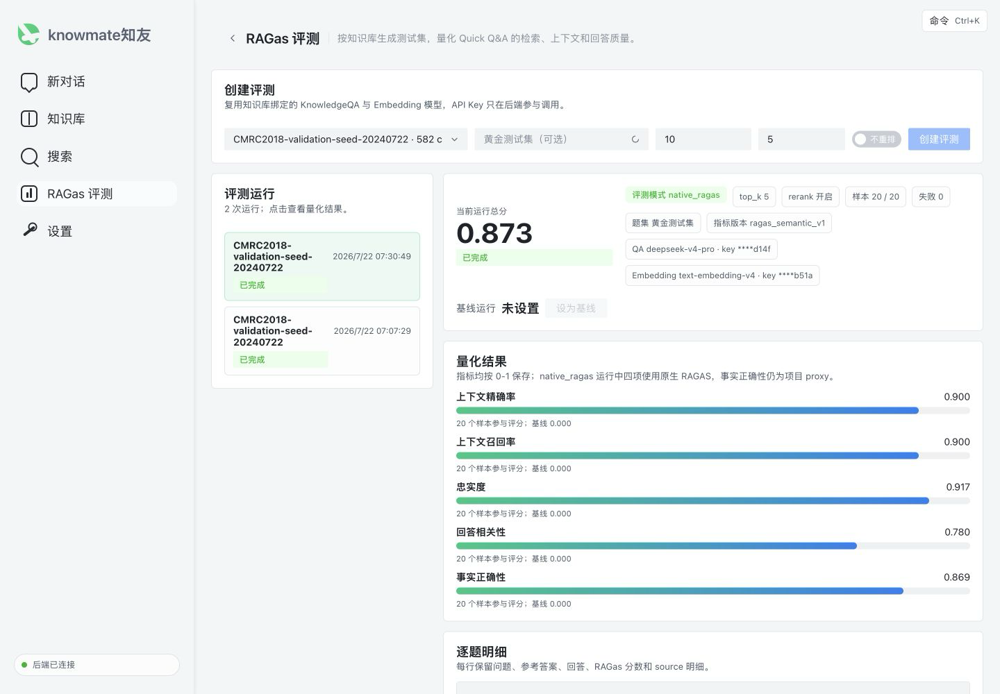

# KnowMate v1.1：CMRC2018 可复现 native RAGAS 验证

v1.1 在 v1.0 知识库级评测闭环上补齐一套可复现、可审计的中文端到端验收基线。它固定使用
CMRC2018 官方 dev/validation 数据，将数据准备、200 篇纯 context 入库、动态 chunk 绑定、黄金集导入、
Quick Answer 调用和 native RAGAS 评分串成两阶段自动化流程，并对关闭/开启 rerank 做同题集 A/B。



> 截图来自真实本地运行：20/20 样本完成、`top_k=5`、rerank 开启，页面直接显示
> `评测模式 native_ragas`。v1.0 原始界面截图继续保留在 `docs/assets/v1.0/`。

## 本版本新增

- 固定数据源：CMRC2018 官方 `cmrc2018_dev.json`，锁定仓库 commit 与原文件 SHA-256。
- 固定随机种子 `20240722`：选择 20 篇目标 context、180 篇干扰 context 和 20 道来自不同目标
  context 的黄金题。
- `corpus/` 中恰好生成 200 个 `.txt`，每个文件逐字节只保存原始 context，不附加 question、answer
  或评测 metadata。
- 为每篇文档保存稳定 `dataset_context_id`、文件名和内容哈希；上传后再映射项目动态生成的
  document ID 与 chunk ID。
- chunk 绑定只接受当前知识库内、启用、非 parent 且实际包含参考答案的 chunk；结果转换为
  `POST /api/v1/evaluations/testsets` 所需 JSON。
- 自动顺序运行 `top_k=5, rerank=false` 与 `top_k=5, rerank=true`，保存逐题 JSON 和 Markdown 对照报告。
- 强制 native 模式不再静默降级：native judge 失败时运行失败并记录
  `evaluator_config.mode=native_ragas_failed`；成功验收必须明确等于 `native_ragas`。
- 评测页面新增实际 evaluator mode、`top_k` 和 rerank 状态；`semantic_proxy` 运行会显示非原生警告。

## 数据和两阶段流程

完整命令与字段说明见 [CMRC2018 中文小数据集端到端验证](cmrc2018-validation.md)。核心流程为：

```text
官方 dev JSON + 固定 seed
  -> 200 个纯 context 文件 + 20 题原始黄金 manifest
  -> 上传并等待 200 篇文档处理完成
  -> dataset_context_id -> document_id
  -> 在目标文档 chunks 中定位真实答案
  -> dataset_context_id -> document_id -> expected_chunk_id
  -> 导入黄金测试集
  -> Quick Answer rerank off/on
  -> native RAGAS 模式硬校验
  -> comparison.json / comparison.md / 页面截图
```

主要命令：

```bash
python -m scripts.cmrc2018_e2e prepare --output-dir storage/cmrc2018_validation --seed 20240722
python -m scripts.cmrc2018_e2e upload --dataset-dir storage/cmrc2018_validation --base-url http://127.0.0.1:8000 --knowledge-base-id <KB_ID> --timeout 3600
python -m scripts.cmrc2018_e2e bind --dataset-dir storage/cmrc2018_validation --base-url http://127.0.0.1:8000 --knowledge-base-id <KB_ID>
python -m scripts.cmrc2018_e2e run --dataset-dir storage/cmrc2018_validation --base-url http://127.0.0.1:8000 --knowledge-base-id <KB_ID> --top-k 5 --timeout-per-run 3600
```

真正执行 Evaluation 的 Celery worker 必须设置：

```bash
export RAGAS_EVALUATOR_MODE=native
```

脚本会在保存结果后检查两次运行的 `status=completed` 和
`evaluator_config.mode=native_ragas`；任何一次使用 `semantic_proxy` 都会非零退出。

## 真实验收结果

专用知识库包含 200 篇互不相同的 context，黄金集包含 20 题，所有
`expected_chunk_ids` 均通过当前知识库归属、启用状态、非 parent 状态和答案包含关系校验。

| 配置 | Overall | Context precision | Context recall | Faithfulness | Response relevancy | Expected source hit |
| --- | ---: | ---: | ---: | ---: | ---: | ---: |
| `rerank=false` | 0.8769 | 0.9000 | 0.9000 | 0.8667 | 0.8653 | 100% |
| `rerank=true` | 0.8733 | 0.9000 | 0.9000 | 0.9173 | 0.7803 | 100% |

- rerank off run：`fe73573c-613c-4d22-8b77-271f91eacfe9`
- rerank on run：`90e8fe8e-3469-411b-a287-80a49b6eb574`
- 两次均为 20/20 completed、failed 0、`top_k=5`、`evaluator_config.mode=native_ragas`
- 完整报告：`storage/cmrc2018_validation/results/online-native-20260722/comparison.md`

本表只报告一次功能性 A/B，不能据此断言 rerank 的普遍质量收益。四项核心指标
`context_precision`、`context_recall`、`faithfulness` 和 `response_relevancy` 使用 native RAGAS；当前项目的
`factual_correctness` 仍为确定性 proxy。RAGAS 裁判还复用知识库自身 `qa_model_id`，因此这些结果是工程
闭环验证，不是独立 judge、全指标原生、重复实验和统计显著性分析下的正式科研分数。

## 验证

```bash
python -m pytest -q tests/test_cmrc2018_validation.py tests/test_v10_ragas_evaluations.py tests/test_frontend_v10_evaluations.py
ruff check .
python -m compileall -q app scripts tests
npm --prefix frontend run build
```

v1.1 本次验收结果：

- CMRC2018、native 防回退及前端相关测试通过。
- Ruff、compileall、前端生产构建和 `git diff --check` 通过。
- 全量 pytest 为 `259 passed, 2 failed`；两个失败分别来自现有 Windows batch 文件换行检查，以及
  Docker API 镜像缺少 Node.js 导致前端 Node 脚本无法执行，不属于 CMRC2018/native RAGAS 逻辑失败。
